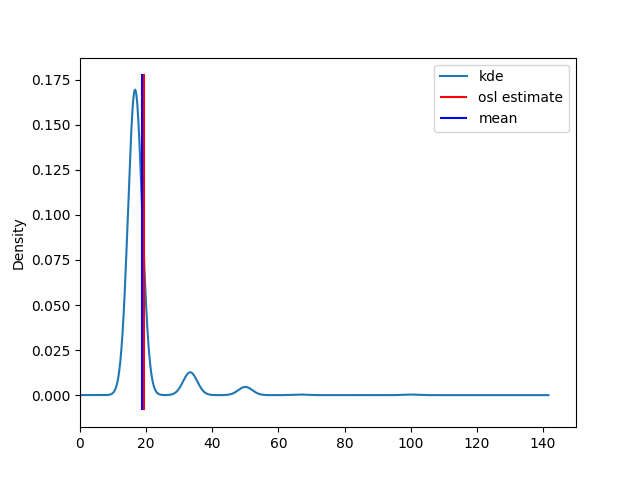
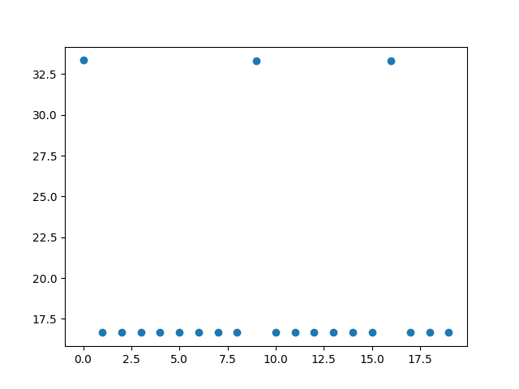
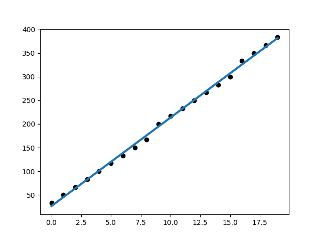

Testing performance reporting tools.

Based on [Criterion](http://www.serpentine.com/criterion/tutorial.html)

Example output:

```txt
❯ python main.py
                     label        min   esitmate        max
0  OLS regression estimate  17.763650  19.207428  19.860302
1                 R2 score   0.998398   0.999660   0.999974
2                     mean  17.848299  18.831892  19.873403
3                    stdev   4.914332   7.582488  10.793707
```




